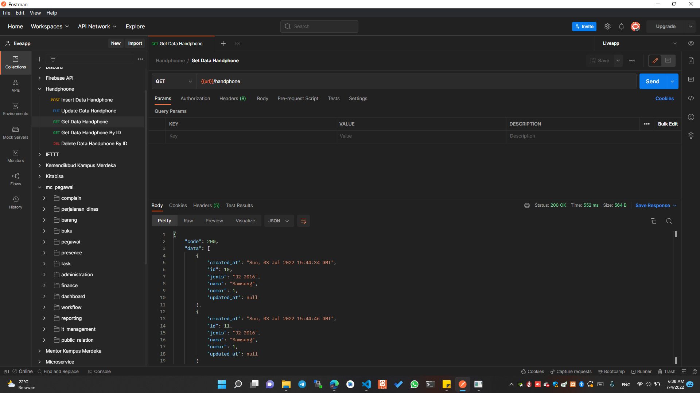

# Handphone App

this is a Python Backend Documentation.

## Installation

Use the Postman for hit api [here](https://www.postman.com/downloads/) to install postman.

## Get Data

Use this endpoint for fetch all data



```bash
/handphone
```

## License
[MIT](https://choosealicense.com/licenses/mit/)