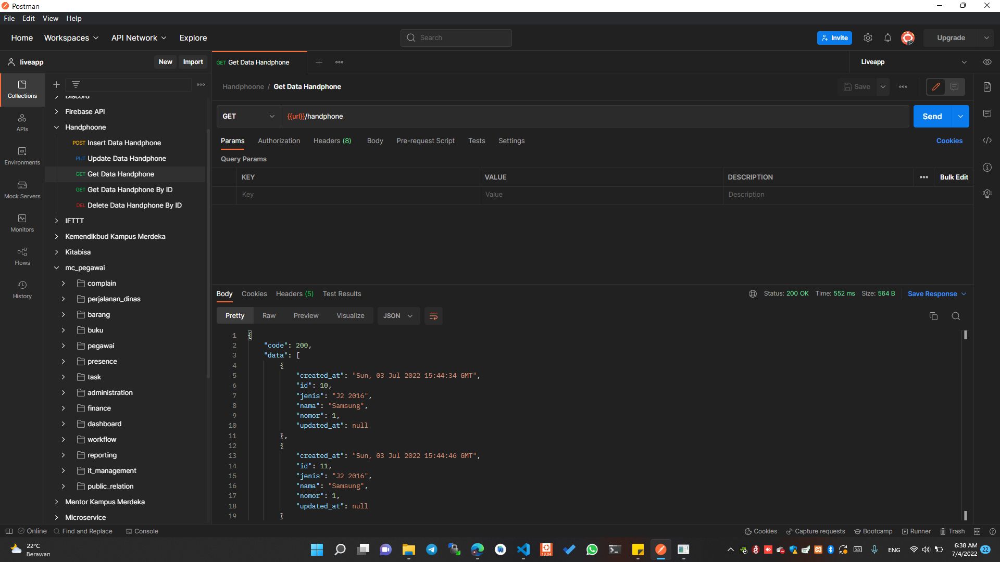
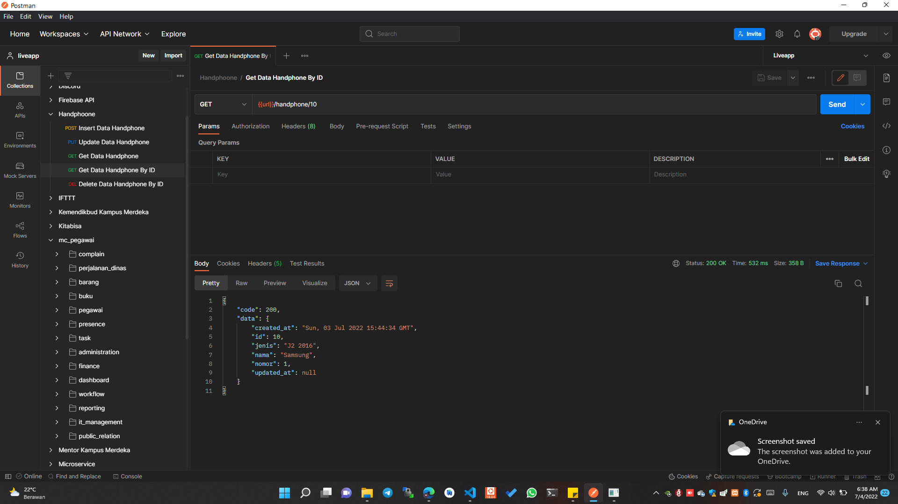
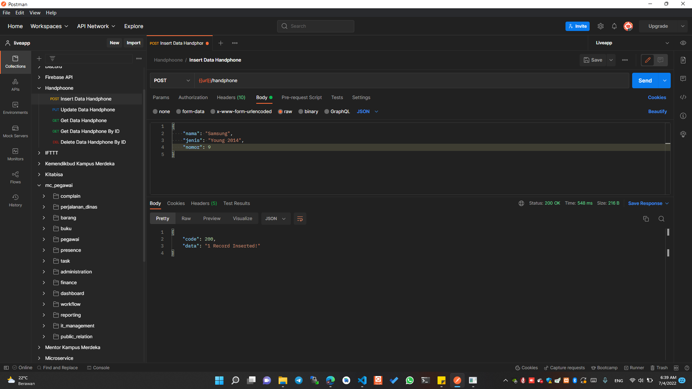
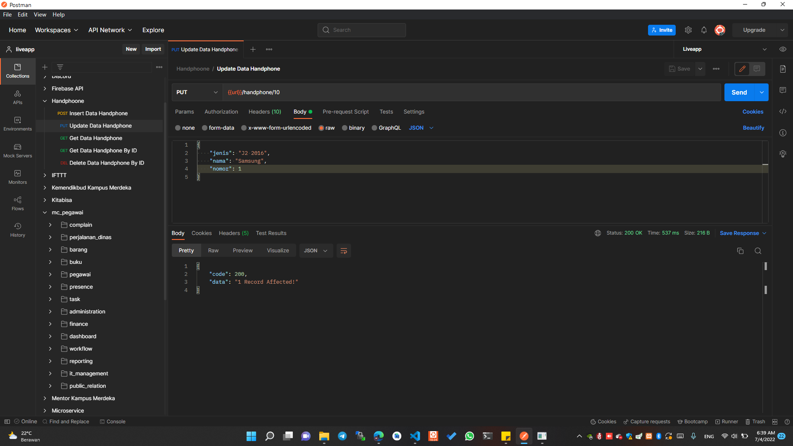
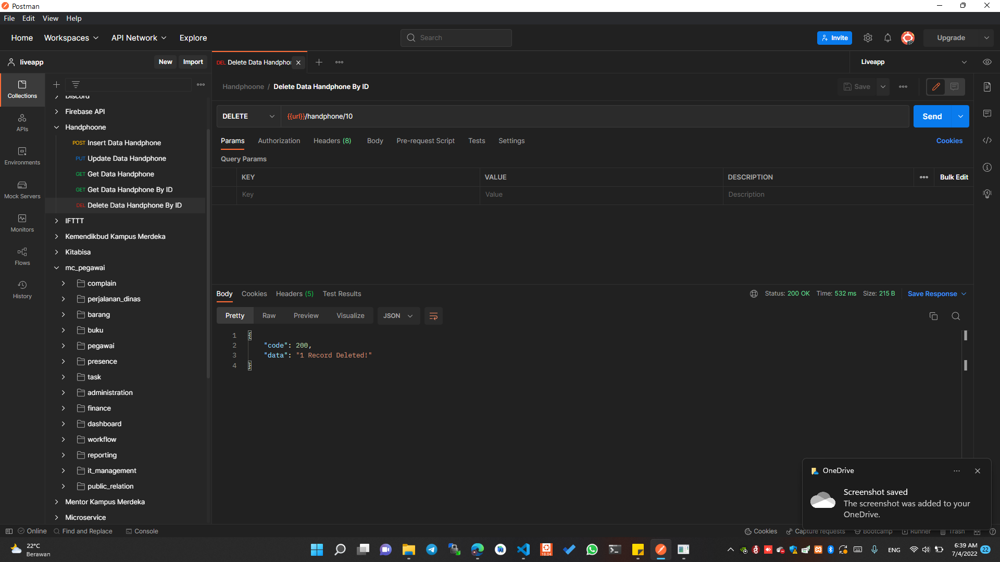

# Handphone App

this is a Python Backend Documentation.

## Installation

Use the Postman for hit api [here](https://www.postman.com/downloads/) to install postman.

## Base URL

Use this base url http://34.152.5.39:2000/ for hit to cloud

## Get Data

Use this endpoint for fetch all data




```bash
GET /handphone
```

## Get Data By ID

Use this endpoint for fetch all data



```bash
GET /handphone/<:id>
```

## Insert Data

Use this endpoint for fetch all data



```bash
POST /handphone/<:id>
```

Body :

```bash
{
    "nama": "Samsung",
    "jenis": "Young 2014",
    "nomor": 9
}
```

## Update Data

Use this endpoint for fetch all data



```bash
PUT /handphone/<:id>
```

Body :

```bash
{
    "nama": "Samsung",
    "jenis": "Young 2014",
    "nomor": 9
}
```

## Update Data

Use this endpoint for fetch all data



```bash
DELETE /handphone/<:id>
```

## License
[MIT](https://choosealicense.com/licenses/mit/)